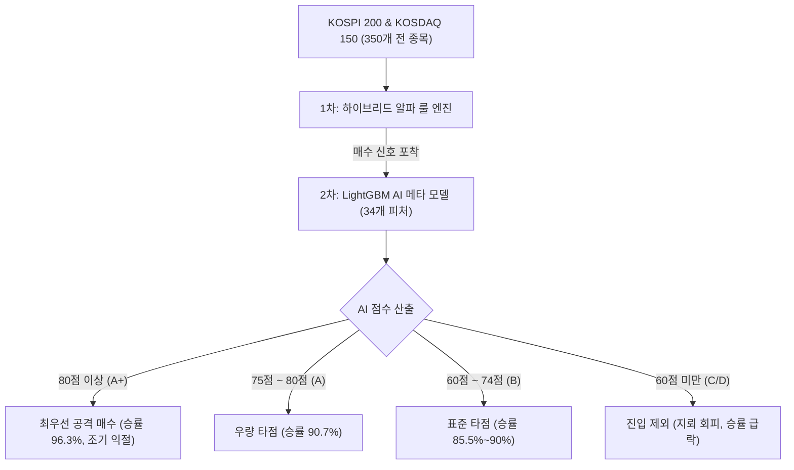

# 하이브리드 알파 & AI 점수(LightGBM) 퀀트 시스템 종합 백서

본 문서는 주식 시그널 스크리너의 핵심 전략인 **[전략 5: 하이브리드 알파]**와, 매수 신호의 질적 가치를 정밀 판별하는 **[AI 점수(LightGBM 메타 라벨링 모델)]**의 수학적 설계, 머신러닝 아키텍처, 데이터셋, 정규분포 및 백테스트 성과를 집대성한 공식 기술 문서입니다.

---

## 1. 개요 및 설계 철학

### 1.1 2단계 퀀트 파이프라인 (Two-Stage Quant Pipeline)
전통적인 룰 기반 퀀트 전략은 명확하지만 시장 환경(약세장, 지수 급락, 개별 악재 등)에 따른 '지뢰 종목'을 완전히 걸러내기 어렵습니다. 본 시스템은 이를 극복하기 위해 **2단계 하이브리드 구조**를 채택했습니다:

1. **1차 필터 (Rule-based Screener)**: 
   * [전략 5: 하이브리드 알파]를 통해 350개 전 종목 중 기술적 과매도 투매 바닥 및 추세 급반등 종목을 1차 선별합니다. (기본 승률 약 80%)
2. **2차 필터 (AI Meta-Labeling Model)**: 
   * 1차에서 걸러진 후보군을 대상으로, **"과거 80%의 성공 패턴에 가까운가, 아니면 20%의 지뢰(물림/손절) 패턴에 가까운가?"**를 머신러닝(LightGBM)으로 정밀 채점하여 **AI 점수(0~100점)**를 부여합니다.



---

## 2. 연계 퀀트 전략: 하이브리드 알파 (Hybrid Alpha)

### 2.1 매수 및 매도 규칙
* **매수 조건 (Group 1 OR Group 2)**:
  * **Group 1 (극과매도 투매 바닥)**:  
    `RSI ≤ 24` · `볼린저밴드 %b ≤ 0.05` · `거래량비율(5일) ≥ 100%` · `20일 이격도 ≤ 95%`
  * **Group 2 (추세 속 급반등 바닥)**:  
    `ADX ≥ 33` · `-DI 하향돌파 ADX` · `거래량비율(5일) ≥ 100%` · `20일 이격도 ≤ 93%`
* **매도 조건**:
  * `RSI ≥ 55` 도달 시 전량 익절 청산
* **리스크 관리**:
  * **물타기 (Scale-in)**: 매수가 대비 **-20% 하락 시 2배 추가 매수** (포지션당 최대 1회)
  * **손절선**: 없음 (우량 350개 종목의 기술적 과매도 복귀력 및 물타기로 극복)
  * **익일 시가 체결**: 신호 당일 15:30 종가 확인 후 다음 날 09:00 시초가 단일가 매매 (+0.25% 수수료/세금/슬리피지 반영)

---

## 3. AI 머신러닝 모델 아키텍처 및 데이터셋

### 3.1 모델 사양 (Model Specifications)
* **파일명**: `data/meta_lgbm_model.pkl`
* **알고리즘**: **LightGBM (Gradient Boosted Decision Trees, GBDT)**
* **학습 일시**: 2026-09-03 14:18:38
* **하이퍼파라미터**:
  ```python
  {
      'objective': 'binary',
      'metric': 'auc',
      'boosting_type': 'gbdt',
      'learning_rate': 0.03,
      'num_iterations': 120,
      'num_leaves': 14,
      'max_depth': 4,
      'min_child_samples': 15,
      'subsample': 0.8,
      'colsample_bytree': 0.8,
      'random_state': 42
  }
  ```

### 3.2 학습 데이터셋 및 타겟 정의
* **데이터 기간**: 2021년 1월 ~ 2026년 8월 말 (최근 5.5개년 전체 일봉)
* **대상 종목**: KOSPI 200 & KOSDAQ 150 (350개 전 종목)
* **학습 타겟 (Label)**: **`is_alpha_winner`**
  단순한 주가 상승(is_winner)이 아닌 다음 조건을 충족한 거래를 '1'로 정의:
  1. **시장 대비 초과 수익 (Alpha)**을 창출했는가?
  2. 하방 위험(-10% 손절선)에 먼저 닿지 않고 **충분한 목표 익절선에 도달**했는가?
  3. 장기간 물리지 않고 **단기간(3~7일) 내 시원하게 반등하여 조기 익절(자금 회전)을 달성**했는가?

---

## 4. 34개 입력 피처(Feature) 구성 및 중요도

신호가 포착된 시점의 시장과 종목 상태를 입체적으로 분석하기 위해 총 34개 변수를 사용합니다.

### 4.1 피처 분류
1. **종목 기술적 지표 (11개)**:  
   `stock_rsi`, `stock_bb_pct`, `stock_bb_width`, `stock_disparity20`, `stock_volume_ratio`, `stock_adx`, `stock_minus_di`, `stock_plus_di`, `stock_macd_osc`, `stock_stoch_k`, `stock_stoch_d`
2. **종목 모멘텀 & 변동성 (6개)**:  
   `stock_ret_3d`, `stock_ret_5d`, `stock_ret_20d`, `stock_volatility_20d`, `stock_rsi_slope_5d`, `stock_disp_slope_5d`
3. **시장(KOSPI/KOSDAQ 지수) 매크로 환경 (11개)**:  
   `idx_rsi`, `idx_bb_pct`, `idx_disparity20`, `idx_adx`, `idx_minus_di`, `idx_plus_di`, `idx_macd_osc`, `idx_ret_3d`, `idx_ret_5d`, `idx_ret_20d`, `idx_volatility_20d`
4. **시장 대비 상대 강도 (4개)**:  
   `rel_ret_5d`, `rel_ret_20d`, `rel_rsi`, `rel_disparity`
5. **동시 다발성 및 룰 그룹 (2개)**:  
   `concurrent_signals_count` (당일 전체 시장 동시 매수 신호 수 - 시장 투매 여부), `trigger_group` (그룹 1 과매도 vs 그룹 2 추세)

### 4.2 AI 모델 피처 중요도 (Top 10 Feature Importance)
| 순위 | 변수명 | 중요도(Gain) | 의미 |
| :---: | :--- | :---: | :--- |
| **1위** | `stock_ret_20d` | **995.8** | 최근 20일간의 주가 낙폭 크기 (낙폭과대 반등 탄력) |
| **2위** | `concurrent_signals_count` | **788.5** | 시장 전체 동시 투매 발생 여부 (지수 바닥 여부) |
| **3위** | `stock_volatility_20d` | **781.7** | 최근 20일간의 주가 변동성 (리스크 패널티) |
| **4위** | `stock_macd_osc` | **629.8** | MACD 오실레이터의 수렴 및 단기 턴어라운드 강도 |
| **5위** | `idx_plus_di` | **512.8** | 시장 전체 지수의 상승 방향성 존재 여부 |
| **6위** | `stock_ret_5d` | **506.7** | 최근 5일간의 단기 급락/반등 모멘텀 |
| **7위** | `rel_disparity` | **445.1** | 지수 대비 종목의 상대적 이격도 괴리율 |
| **8위** | `stock_stoch_d` | **410.6** | 스토캐스틱 슬로우 바닥 다이버전스 |
| **9위** | `rel_ret_5d` | **382.2** | 지수 대비 5일간 초과 수익률(Alpha) |
| **10위**| `stock_rsi_slope_5d`| **356.2** | 최근 5일간 RSI 지표의 상승 반전 가속도 |

---

## 5. AI 점수 정규분포 (5.9개년 전수 분석)

2021년 1월부터 2026년 9월 18일까지 350개 종목에서 발생한 **하이브리드 알파 매수 신호 총 2,594건**의 점수 분포 통계입니다.

* **평균값 (Mean)**: **62.12점**
* **중앙값 (Median)**: **64.00점**
* **표준편차 ($\sigma$)**: **10.68점**

### 백분위 분포표
| 백분위 (Percentile) | AI 점수 | 실전 등급 | 설명 |
| :---: | :---: | :---: | :--- |
| **상위 10%** | **73.6점 이상** | **A+ ~ A** | 시장 대비 반등 탄력이 가장 강력한 최우량 타점 |
| **상위 25%** | **69.6점 이상** | **B+** | 승률 90% 이상 보장되는 우량 타점 |
| **상위 50% (중앙값)** | **64.0점 이상** | **B** | 기본 조건을 충실히 갖춘 표준 권장 타점 |
| **하위 25%** | **56.6점 이하** | **C** | 반등 탄력이 둔화되거나 지수 역풍 위험이 있는 구간 |
| **하위 10%** | **47.3점 이하** | **D (지뢰)** | 과거 실패 패턴(손절/장기 물림)과 유사한 고위험 구간 |

---

## 6. 점수대별 실제 백테스트 성과 분석

하이브리드 알파 전략으로 5.9년간 실행된 **총 1,457회 실제 체결 거래**의 점수대별 성과입니다:

| AI 점수 구간 | 체결 건수 (비중) | 실제 승률 | 건당 평균수익률 | 손익비 (PF) | 평균 보유일 | 물타기 건수 | 실전 평가 |
| :---: | :---: | :---: | :---: | :---: | :---: | :---: | :--- |
| **80점 이상 (A+)** | 27건 (1.9%) | **96.3%** | **+21.20%** | **12.29** | **33.6일** | 3건 | **초특급 타점** (27회 중 26회 승리, 최고속 조기 익절) |
| **75점 ~ 80점 (A)** | 86건 (5.9%) | **90.7%** | **+16.86%** | **13.60** | **45.0일** | 23건 | **최우량 타점** (승률 90% 돌파, 손익비 13.6배) |
| **70점 ~ 75점 (B+)**| 183건 (12.6%) | **90.7%** | **+13.65%** | **11.76** | **41.9일** | 33건 | **우량 타점** (안정적인 두 자릿수 수익률) |
| **60점 ~ 70점 (B)** | 565건 (38.8%) | **85.5%** | **+8.21%** | **3.95** | **46.2일** | 103건 | **표준 타점** (기본 진입 권장) |
| ───────────────── | ─────────────── | ─────────── | ─────────────── | ─────────── | ─────────── | ─────────── | ────────────────────────────────────────── |
| **50점 ~ 60점 (C)** | 375건 (25.7%) | **76.0%** | **+5.58%** | **2.74** | **46.6일** | 50건 | 주의 구간 (수익률 둔화) |
| **50점 미만 (D)** | 221건 (15.2%) | **69.2%** | **+2.38%** | **1.22** | **53.6일** | 28건 | **위험 구간** (손익비 1.22 급락, 54일간 장기 물림) |

### 60점 기준 전후 비교 요약
* **★ 60점 이상 (상위 59.1%, 861건)**:
  * **승률**: **87.5%**
  * **평균 수익률**: **+10.64%**
  * **평균 보유일**: **44.8일**
* **★ 60점 미만 (하위 40.9%, 596건)**:
  * **승률**: **73.5%** (-14.0%p 급락)
  * **평균 수익률**: **+4.40%** (2.4배 감소)
  * **평균 보유일**: **49.2일** (+4.4일 지연)

---

## 7. 실전 매매 운용 가이드

1. **'60점'은 절대적인 진입 마지노선**:
   * 스크리너에 매수 신호가 떴더라도 **AI 점수가 60점 미만인 종목은 원칙적으로 진입을 제외(Pass)**합니다. 이것만으로도 전체 거래의 41%에 달하는 저효율 지뢰를 사전에 차단할 수 있습니다.
2. **75점 이상 발견 시 비중 확대 (Strong Buy)**:
   * 75점 이상(A~A+) 구간은 **승률 90.7% ~ 96.3%, 손익비 12~13배**를 자랑하는 초특급 기회입니다. 포트폴리오 여유 자금이 허용하는 한 최우선 순위로 비중을 싣는 것이 계좌 성장을 가속화합니다.
3. **자금 회전율(조기 익절) 극대화**:
   * 80점 이상 종목은 평균 33.6일 만에 조기 익절을 달성하므로, 자금 묶임 현상 없이 연간 회전율을 2배 이상 높일 수 있습니다.
4. **스크리너 설정 연동**:
   * 관리자 화면(admin.html)의 퀀트 전략 설정에서 **[우선순위: AI 점수 큰 순서대로]**로 지정해두면, 매일 저녁 복수의 신호가 떴을 때 자동으로 최상급 종목부터 상단에 정렬되어 손쉽게 매수할 수 있습니다.
